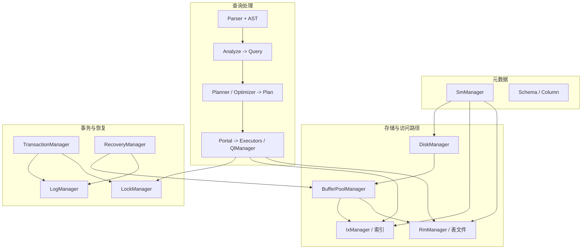

# EasyDB 架构总览

## 设计目标

EasyDB 是一个教学与工程兼顾的 **C++17** 关系型数据库实现，覆盖：

- 基于**页**的存储与缓冲管理  
- **B+ 树**与**可扩展哈希**两种索引  
- **SQL** 解析 → 语义分析 → **查询计划** → **火山模型执行器**  
- **两阶段封锁（2PL）**、**WAL** 日志与**崩溃恢复**

## 逻辑分层

从下至上可概括为：

## 静态库与构建顺序

根目录 `CMakeLists.txt` 将 `src/` 下各子目录编译为多个静态库，最终链接为 `libeasydb.a` 与可执行文件 `easydb_server`（见 `src/CMakeLists.txt`）。

链接顺序上，**缓冲池**依赖**磁盘**；**记录/索引**依赖**缓冲池 + 磁盘**；**系统管理器**聚合元数据并操作表与索引文件；**执行器**依赖目录、记录、索引与事务。

## 一次 SQL 请求的路径（简化）

对应实现主要在 `src/easydb.cpp` 的 `client_handler`：

1. **读套接字** → 得到 SQL 字符串。  
2. **`yy_scan_string` + `yyparse`** → 生成 AST（`ast::parse_tree`）。  
3. **`Analyze::do_analyze`** → 填充 `Query`（表、列、条件、聚合等）。  
4. **`Optimizer::plan_query`** → 非 DML 快捷语句直接生成 `OtherPlan` 等；否则调用 **`Planner::do_planner`**。  
5. **`Portal::start`** → 将 `Plan` 转为 **`AbstractExecutor` 树**（或 DDL/工具类计划）。  
6. **`Portal::run`** → **`QlManager`** 执行（`select_from` / `run_dml` / `run_cmd_utility` 等）。  
7. **事务**：每条请求在 `Context` 中绑定 `Transaction`；隐式事务在语句结束后 **`Commit`**，异常时 **`Abort`**。  
8. **结果** 写入 `Context` 的缓冲区，序列化后 **`write`** 回客户端。

全局互斥：Flex/Bison 使用全局缓冲区，解析阶段用 **`buffer_mutex`** 保护（同一时刻仅一个线程解析）。

## 与专题文档的对应关系

- 存储与页格式：见 [storage-disk-page-table.md](storage-disk-page-table.md)、[buffer-pool.md](buffer-pool.md)、仓库内 [../storage/storage.md](../storage/storage.md)。  
- SELECT 细节： [../SELECT查询流程详解.md](../SELECT查询流程详解.md)。  
- 优化与 SPJ： [../optimizer/optimizer.md](../optimizer/optimizer.md)、[../spj/spj.md](../spj/spj.md)。

## 下一步阅读

| 若你关心… | 建议打开 |
|-----------|----------|
| 服务端如何启动 DB、如何做恢复 | [network-server.md](network-server.md) |
| 页与文件 ID | [storage-disk-page-table.md](storage-disk-page-table.md) |
| SQL 如何变成 Query | [analyze.md](analyze.md) |
| Plan 如何变成执行器 | [execution-and-portal.md](execution-and-portal.md) |
